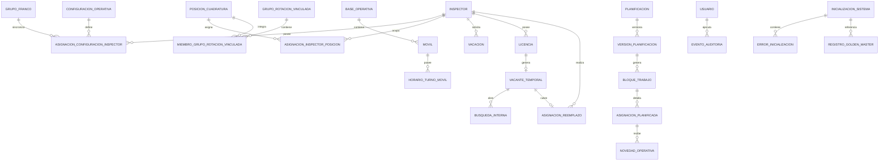

# Modelo de Datos Conceptual

**Versión:** 2.6

## 1. Principios

- PostgreSQL será la fuente de verdad.
- Las reglas generales y las configuraciones particulares se almacenan separadamente.
- Los datos aprobados no se eliminan físicamente; se versionan, cancelan o inactivan.
- La cuadratura real debe conservar referencia a la asignación planificada original.
- Las vigencias se modelan con fechas desde/hasta.

## 2. Entidades principales

### Inspector

- id
- legajo
- nombre
- estado
- tipoPlantel: titular | reemplazante
- fechaAlta
- fechaBaja

### GrupoFranco

- id
- nombre
- fechaAncla
- posicionInicialCiclo
- activo

Permite que varios inspectores compartan el mismo patrón 5×3.

### ConfiguracionOperativa

- id
- nombre
- tipo: general | fijoMovil | rotacionEspecial
- secuenciaTurnos
- secuenciaMoviles
- vigenciaDesde
- vigenciaHasta
- estado

### AsignacionConfiguracionInspector

- inspectorId
- configuracionOperativaId
- grupoFrancoId
- fechaDesde
- fechaHasta
- turnoInicial
- movilInicial
- posicionInicialTurno
- posicionInicialMovil

### PosicionCuadratura

Representa una línea continua de ciclo independiente de la persona que la ocupa.

- id
- codigo
- nombre
- tipo: general | movil4 | vinculada
- grupoFrancoId
- configuracionOperativaId
- fechaAncla
- posicionInicialCiclo
- turnoInicial
- movilInicial
- desfaseDiasReferencia
- origenAncla: historicoExcel | configuracion
- inicializacionSistemaId
- estado
- vigenciaDesde
- vigenciaHasta

Catálogo inicial del móvil 4:

| Código | Fecha ancla | Código inicial | Desfase desde 01/05/2026 |
|---|---:|---|---:|
| M4-P01 | 01/05/2026 | M4 | 0 |
| M4-P02 | 02/05/2026 | T4 | 1 |
| M4-P03 | 04/05/2026 | N4 | 3 |
| M4-P04 | 05/05/2026 | M4 | 4 |
| M4-P05 | 07/05/2026 | T4 | 6 |

### AsignacionInspectorPosicion

- posicionCuadraturaId
- inspectorId
- fechaDesde
- fechaHasta
- motivo
- aprobadoPor

Permite cambiar a la persona que ocupa una posición sin reiniciar su ciclo.

### GrupoRotacionVinculada

- id
- nombre
- secuenciaMovilExterno
- reglaAlternancia
- vigenciaDesde
- vigenciaHasta
- estado

### MiembroGrupoRotacionVinculada

- grupoRotacionVinculadaId
- posicionCuadraturaId
- rol: posicionMovil4 | posicionMovilExterno
- ordenAlternancia

### BaseOperativa

- id
- nombre
- ubicación descriptiva
- estado

### Movil

- id
- numero
- baseOperativaId
- capacidadMaxima
- estado: activo | mantenimiento | fueraServicio | reemplazado
- vigenciaDesde
- vigenciaHasta

### HorarioTurnoMovil

- movilId
- turno: M | T | N
- horaInicio
- horaFin
- vigenciaDesde
- vigenciaHasta

### Planificacion

- id
- periodoDesde
- periodoHasta
- estado: borrador | enRevision | observada | aprobadaPublicada | cerrada
- versionActualId
- creadaPor
- enviadaRevisionPor
- aprobadaPublicadaPor
- fechaAprobacionPublicacion
- cerradaPor
- fechaCierre

### VersionPlanificacion

- id
- planificacionId
- numeroVersion
- estado: borrador | enRevision | observada | aprobadaPublicada | reemplazada | cerrada
- motivoCambio
- observacionesRevision
- creadaPor
- creadaEn
- aprobadaPublicadaPor
- aprobadaPublicadaEn
- versionAnteriorId

### BloqueTrabajo

- id
- versionPlanificacionId
- inspectorId
- fechaInicio
- fechaFin
- turno
- movilId
- grupoCiclo
- origen: generado | manual | importado

### AsignacionPlanificada

- id
- bloqueTrabajoId
- inspectorId
- fechaOperativa
- turno
- movilId
- codigo
- estado

### NovedadOperativa

- id
- inspectorId
- fechaDesde
- fechaHasta
- tipo
- motivo
- estado
- asignacionPlanificadaId
- creadaPor

### AsignacionReal

- id
- fechaOperativa
- inspectorId
- turno
- movilId
- asignacionPlanificadaId
- novedadOperativaId
- motivoDiferencia

> Decisión técnica 2.5: BASE se origina en bloques; PLANIFICADA se origina en ajustes; REAL se origina en eventos. Las tres capas poseen una proyección diaria materializada por versión en `dia_cronograma`.

### Vacacion

- id
- inspectorId
- cantidadDias: 7 | 14 | 21 | 28 | 35
- fechaInicio
- fechaFin
- diasCorridos: siempre verdadero
- francosPrevios: 3
- cantidadTrabajosDemanda: 0 | 1 | 2
- francoPosterior: 1
- estado
- aprobadaPor
- versionPlanificacionId

### TrabajoDemandaVacacion

- id
- vacacionId
- fecha
- turno
- movilId
- motivoNecesidad
- prioridadTurnoAplicada: tarde | noche | excepción
- aprobadoPor

**Restricciones:**

- 7 días: cero trabajos a demanda.
- 14 y 28 días: un trabajo a demanda.
- 21 y 35 días: dos trabajos a demanda.
- Todo trabajo a demanda respeta capacidad máxima.

### Licencias y reemplazos

Las licencias se almacenan en `NovedadOperativa` con tipo `LICENCIA`:

- inspectorId
- capaAplicacion: planificada | real
- fechaDesde
- fechaHasta opcional
- motivo
- estado
- creadaPor / aprobadaPor

No existen tablas de vacante, búsqueda ni ciclo especial de licencia.

Un reemplazo, si existe, se almacena en `ReemplazoNovedad`:

- novedadId
- posicionId
- inspectorTitularId
- inspectorReemplazanteId
- fechaDesde / fechaHasta
- motivo
- aprobadoPor

La proyección diaria conserva por separado titular y asignado.

### RequerimientoCobertura

- id
- fecha
- turno
- movilId
- cantidadObjetivo: 1
- capacidadMaxima: 2
- cantidadAsignada
- estado: hueco | cubierta | reforzada
- alertaActiva
- motivoHueco
- responsableAceptacionId
- fechaAceptacion
- versionPlanificacionId

**Restricciones:**

- 0 asignaciones: hueco con alerta.
- 1 asignación: cubierta.
- 2 asignaciones: reforzada.
- 3 o más: bloqueante.
- No se aprueba/publica una versión con huecos sin motivo y responsable.

### Usuario, Rol, Permiso

Modelo RBAC:

- Usuario
- Rol
- Permiso
- UsuarioRol
- RolPermiso

Roles iniciales:

- `ADMINISTRACION_SEGURIDAD_VIAL`
- `JEFE_SECTOR`
- `ADMINISTRADOR_SISTEMA`
- `CONSULTA`
- `AUDITOR`

La separación de funciones impide que Administración de Seguridad Vial apruebe su propia versión.

### EventoAuditoria

- id
- usuarioId
- fechaHora
- entidad
- entidadId
- accion
- valorAnterior
- valorNuevo
- motivo
- ip

### InicializacionSistema

Representa la carga extraordinaria y única que da origen a la cuadratura base.

- id
- archivoOriginal
- hojaOrigen: valor fijo `Móviles CBA 26-27`
- hashArchivo
- estado: cargada | validada | confirmada | fallida | revertida
- fechaCarga
- fechaConfirmacion
- usuarioCargaId
- usuarioConfirmacionId
- resumenValidacion
- cantidadInspectores
- cantidadBloques
- cantidadAsignaciones
- esInicializacionActiva
- fechaReversion
- usuarioReversionId
- motivoReversion

**Restricción:** solo puede existir una inicialización confirmada y activa.

### ErrorInicializacion

- inicializacionSistemaId
- fila
- columna
- valor
- codigoError
- detalle
- severidad

### RegistroGoldenMaster

- id
- inicializacionSistemaId
- inspectorId
- fechaOperativa
- codigoEsperado
- movilEsperado
- turnoEsperado
- tipoDiaEsperado

## 3. Relaciones

## 4. Decisiones pendientes del modelo

- Persistir o derivar la cuadratura base.
- Persistir o proyectar la cuadratura real.
- Definir si el ancla del ciclo pertenece al inspector, al grupo de francos o a ambos.
- Definir el procedimiento físico de reversión de una inicialización antes de la puesta en operación.
- Definir la fecha operativa de un turno nocturno que termina al día siguiente.

## 6. Modelo físico cerrado en versión 2.5

El esquema ejecutable, las migraciones, restricciones, procedimientos y vistas se encuentran en `database/` y en `12_Modelo_Fisico_PostgreSQL_v2_6.md`.

## 7. Entidades físicas agregadas en 2.6

### InicializacionInspectorStaging

Normaliza una fila del Excel y contiene la posición, perfil, ancla y último estado inferido.

### InicializacionDiaStaging

Conserva cada celda operativa con código de origen, código normalizado, fecha, tipo de día, turno, móvil, mes y dirección de celda.

### InicializacionBloqueStaging

Contiene bloques de trabajo/franco reconstruidos antes de confirmar.

### EstadoInicialPosicion

Guarda la fecha de referencia y posición del ciclo desde la cual continúa el motor.

### Posición M4-P03-EXT

Segunda posición del grupo vinculado. La alternancia se representa cambiando ocupantes por vigencia, no mutando la identidad de las posiciones.

### Vistas operativas

- `v_movil4_posiciones_vigentes`.
- `v_tablero_huecos`.
- `fn_tablero_huecos`.
- `fn_proponer_trabajos_demanda_vacacion`.
