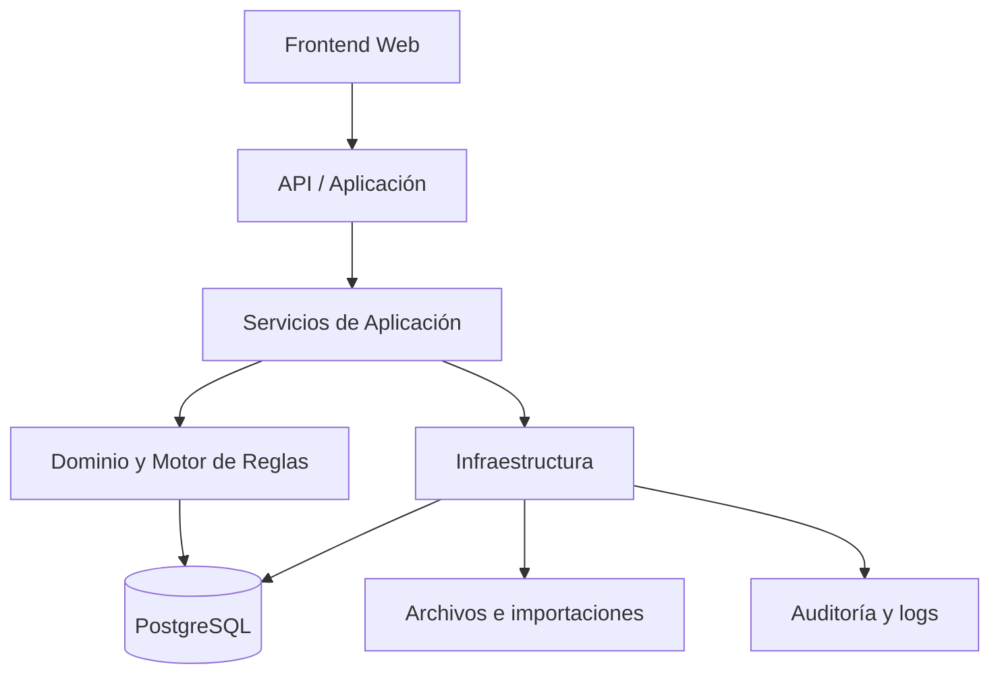

# Arquitectura del Sistema

**Versión:** 2.6

## 1. Estilo arquitectónico

Se adopta un **monolito modular** con API backend, frontend web y base de datos relacional.

No se recomiendan microservicios en la primera etapa. La complejidad principal está en las reglas y la trazabilidad, no en distribuir procesos entre servidores. Primero el orden; después, si hace falta, la orquesta sinfónica.

## 2. Capas



### Presentación

- Calendario planificado.
- Calendario real.
- Administración.
- Vacaciones y licencias.
- Vacantes y reemplazos.
- Inicialización extraordinaria desde Excel.
- Reportes.
- Auditoría.

### Aplicación

Coordina casos de uso y transacciones:

- Generar cuadratura.
- Publicar planificación.
- Registrar novedad.
- Aplicar vacaciones.
- Registrar licencia y su impacto de cobertura.
- Asignar reemplazo.
- Inicializar la cuadratura base desde el Excel aprobado.
- Comparar plan vs real.

### Dominio

Contiene:

- Ciclo continuo 5×3.
- Secuencia M → N → T.
- Rotación 1 → 5 → 3 → 2.
- Integridad de bloque.
- Capacidad máxima.
- Configuraciones operativas.
- Posiciones de cuadratura independientes de la persona.
- Grupos de rotación vinculada y alternancia móvil 4/móvil externo.
- Reglas de vacaciones por duración, días corridos, trabajo a demanda y reintegro.
- Reglas de cobertura.
- Reglas de aprobación.

### Infraestructura

- Persistencia PostgreSQL.
- Archivos.
- Excel.
- Autenticación.
- Logs.
- Backups.
- Exportaciones.

## 3. Módulos

1. Identidad y permisos.
2. Administración maestra.
3. Configuraciones operativas y posiciones de cuadratura.
4. Grupos de rotación vinculada.
5. Generador de cuadratura.
6. Planificación y versiones.
7. Operación real y novedades.
8. Cobertura y alertas.
9. Vacaciones.
10. Licencias y reemplazos opcionales.
11. Inicialización y Golden Master.
12. Reportes.
13. Auditoría.

## 4. Motor de reglas

El motor no debe contener condiciones por nombre de inspector.

Entrada:

- Período.
- Estado inicial reconstruido desde el Excel histórico.
- Grupo de francos.
- Configuración operativa.
- Secuencia de turnos.
- Secuencia de móviles.
- Horarios.
- Vigencias.

Salida:

- Bloques de trabajo.
- Francos.
- Asignaciones diarias.
- Alertas.
- Errores de integridad.

## 5. Separación base, planificada y real

La arquitectura soportará tres conceptos lógicos:

- Base generada.
- Planificación aprobada.
- Operación real.

**Decisión cerrada:** BASE persiste bloques y materializa días; PLANIFICADA y REAL persisten snapshots diarios por versión, derivados de ajustes y eventos inmutables.

## 6. API conceptual

- `POST /planning/generate`
- `POST /planning/{id}/submit`
- `POST /planning/{id}/approve-and-publish`
- `GET /planning/{id}/calendar`
- `POST /operations/absence`
- `POST /vacations`
- `POST /licenses`
- `POST /vacancies/{id}/replacement`
- `POST /initialization/excel/preview`
- `POST /initialization/excel/confirm`
- `GET /initialization/status`
- `POST /initialization/revert` — acción extraordinaria, solo antes del inicio operativo
- `GET /reports/coverage`
- `GET /audit`

## 7. Decisiones arquitectónicas

- ADR-001: monolito modular.
- ADR-002: PostgreSQL como fuente de verdad.
- ADR-003: reglas centralizadas en dominio.
- ADR-004: configuraciones particulares por datos y vigencias.
- ADR-005: auditoría inmutable.
- ADR-006: inicializador transaccional de ejecución única, restringido a la hoja `Móviles CBA 26-27`, con vista previa, Golden Master y bloqueo posterior.
- ADR-007: ambientes Local y Producción.
- ADR-008: pruebas de regresión usando la cuadratura histórica aprobada.
- ADR-009: el móvil 4 se modela mediante posiciones continuas y desfasadas, no mediante nombres fijos.
- ADR-010: las duplas vinculadas se representan como relaciones de datos entre posiciones, con alternancia configurable.
- ADR-011: el Excel histórico determina los estados iniciales.
- ADR-012: aprobar y publicar es una única transacción del Jefe del sector.
- ADR-013: las versiones publicadas son inmutables.
- ADR-014: cobertura objetivo 1, máximo 2 y huecos con aceptación justificada.


## 8. Ciclo de vida del inicializador

1. **No inicializado:** el sistema admite cargar y previsualizar el Excel.
2. **Validado:** no se ha persistido la cuadratura base.
3. **Confirmado:** se crea la cuadratura base y se activa el Golden Master.
4. **Bloqueado:** las rutas ordinarias de inicialización quedan deshabilitadas.
5. **Revertido:** solo mediante permiso extraordinario y antes de la operación efectiva.

El inicializador no forma parte del flujo diario del sistema y no debe utilizarse para actualizar cuadraturas futuras.


## 9. Servicio de vacaciones

El módulo de vacaciones debe:

1. Validar que la duración sea 7, 14, 21, 28 o 35 días corridos.
2. Verificar los tres francos previos.
3. Generar el tramo de vacaciones.
4. Determinar la cantidad de trabajos a demanda:
   - 0 para 7 días;
   - 1 para 14 o 28 días;
   - 2 para 21 o 35 días.
5. Buscar necesidad operativa, priorizando tarde o noche.
6. Validar capacidad máxima.
7. Generar un franco posterior.
8. Reincorporar al inspector a la cuadratura planificada correspondiente a la fecha.


## 10. Flujo de aprobación

```text
Administración de Seguridad Vial: Borrador → En revisión
Jefe del sector: En revisión → Observada
Jefe del sector: En revisión → Aprobada y publicada
Jefe del sector: Aprobada y publicada → Cerrada
```

La transición `Aprobada y publicada` es atómica. Si existen huecos, valida motivo y responsable.

## 11. Configuración verificada del móvil 4

| Posición | Referencia histórica | Ancla | Código | Desfase en días |
|---|---|---:|---|---:|
| M4-P01 | Del Bel | 01/05/2026 | `M4` | 0 |
| M4-P02 | Carranza M. | 02/05/2026 | `T4` | 1 |
| M4-P03 | Haro / Ramos G. | 04/05/2026 | `N4` | 3 |
| M4-P04 | Carranza G. | 05/05/2026 | `M4` | 4 |
| M4-P05 | Mainardi | 07/05/2026 | `T4` | 6 |

La única dupla vinculada detectada es Haro–Ramos G.


## 12. Persistencia de cuadraturas — decisión 2.5

- BASE: bloques canónicos persistidos; días regenerables.
- PLANIFICADA: ajustes persistidos; snapshot diario por versión.
- REAL: eventos append-only; snapshot diario por versión.
- PostgreSQL aplica restricciones de capacidad, vigencias, unicidad e inmutabilidad.
- La aplicación invoca procedimientos de materialización y workflow dentro de transacciones.

## 13. Implementación operativa — versión 2.6

- El parser Excel vive en `implementation/src/seguridad_vial/excel_initializer.py`.
- El preview no toca tablas operativas; el repositorio carga tablas `*_staging`.
- `sp_confirmar_inicializacion` crea inspectores, posiciones, asignaciones, estado inicial, BASE y Golden Master dentro de una transacción.
- `sp_revertir_inicializacion` solo actúa antes de capas derivadas o eventos reales.
- El móvil 4 se administra con vigencias y procedimientos de sustitución/intercambio.
- El tablero de huecos se expone como vista, función SQL, API JSON y página web.
- La búsqueda de trabajos a demanda utiliza únicamente huecos reales de cobertura y prioriza T → N → M.
