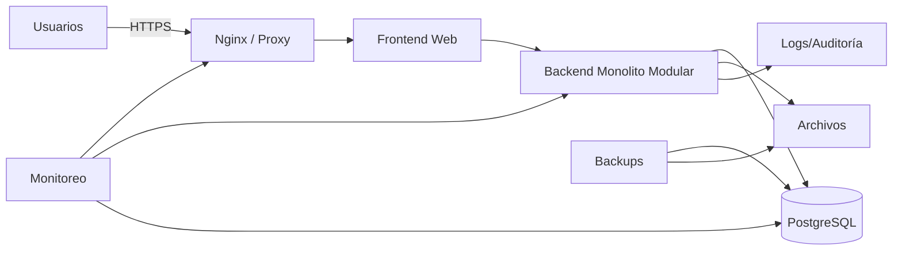

# Infraestructura del Proyecto

**Versión:** 2.6

## 1. Ambientes

El proyecto tendrá inicialmente:

- **Local:** desarrollo, pruebas automatizadas y validación funcional.
- **Producción:** servidor aún no definido.

No existe ambiente QA independiente.

## 2. Topología recomendada



## 3. Stack sugerido

| Capa | Sugerencia |
|---|---|
| Frontend | React + TypeScript |
| Backend | .NET 8 o NestJS |
| Base | PostgreSQL |
| Proxy | Nginx |
| Entorno local | Docker Compose |
| Versionado | Git |
| Monitoreo inicial | Uptime Kuma + logs estructurados |

La tecnología final debe considerar la experiencia del equipo.

## 4. Repositorio

```text
/frontend
/backend
  /modules
    /identity
    /administration
    /operational-config
    /schedule-positions
    /linked-rotation-groups
    /planning
    /operations
    /coverage
    /vacations
    /licenses
    /replacements
    /bootstrap-initialization
    /reports
    /audit
/database
/infrastructure
/docs
/tests
```

## 5. Publicación sin QA

Flujo obligatorio:

1. Desarrollo local.
2. Revisión de código.
3. Pruebas unitarias.
4. Pruebas de integración.
5. Ejecución de golden master histórico.
6. Prueba funcional local.
7. Backup de producción.
8. Migración.
9. Despliegue.
10. Smoke test y posibilidad de rollback.

## 6. Seguridad

- HTTPS obligatorio.
- Permisos validados en backend.
- Contraseñas almacenadas mediante hash seguro, no cifrado reversible.
- Secretos fuera del repositorio.
- Base sin acceso público.
- Auditoría inmutable.
- Datos médicos visibles solo para perfiles autorizados.

## 7. Backups

Propuesta inicial, pendiente de aprobación:

- Backup diario de PostgreSQL.
- Retención 30 días.
- Copia semanal adicional.
- Prueba periódica de restauración.
- Respaldo del Excel original utilizado para la inicialización y de su reporte de validación.

## 8. Pendientes no funcionales

- Usuarios concurrentes.
- Tiempo de respuesta.
- Disponibilidad.
- RPO.
- RTO.
- Retención de auditoría.
- Tamaño máximo de Excel.
- Navegadores.
- Uso móvil.
- Política de sesión.
- Servidor/proveedor de producción.


## 9. Desactivación del inicializador

Después de una inicialización exitosa:

- la funcionalidad queda bloqueada por estado de sistema y autorización;
- no se expone como opción operativa habitual;
- los endpoints de confirmación rechazan nuevas ejecuciones;
- el archivo original y su hash se conservan como evidencia;
- una reversión exige permiso extraordinario, auditoría y condición de no haber iniciado la operación productiva.


## 10. Controles de autorización

- El backend valida los roles Administración de Seguridad Vial y Jefe del sector.
- Aprobar/publicar se ejecuta en una única transacción.
- Las versiones publicadas son inmutables.
- Desbloqueos técnicos exigen un rol separado y auditoría.

## 11. Ejecución de la implementación 2.6

La aplicación Python se instala desde `implementation/`. Requiere `artifact-tool` para el Excel y el extra `postgres` para confirmar/revertir. El tablero web se sirve desde FastAPI. La base debe ejecutar V001 a V011 en orden.
