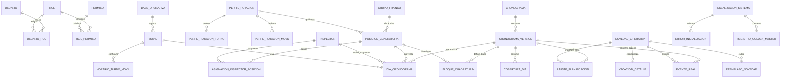

# ERD Físico Resumido

**Versión:** 2.6

```mermaid
erDiagram
    USUARIO ||--o{ USUARIO_ROL : posee
    ROL ||--o{ USUARIO_ROL : asigna
    ROL ||--o{ ROL_PERMISO : contiene
    PERMISO ||--o{ ROL_PERMISO : habilita

    BASE_OPERATIVA ||--o{ MOVIL : agrupa
    MOVIL ||--o{ HORARIO_TURNO_MOVIL : configura
    PERFIL_ROTACION ||--o{ PERFIL_ROTACION_TURNO : ordena
    PERFIL_ROTACION ||--o{ PERFIL_ROTACION_MOVIL : ordena

    GRUPO_FRANCO ||--o{ POSICION_CUADRATURA : sincroniza
    PERFIL_ROTACION ||--o{ POSICION_CUADRATURA : gobierna
    POSICION_CUADRATURA ||--o{ ASIGNACION_INSPECTOR_POSICION : ocupa
    INSPECTOR ||--o{ ASIGNACION_INSPECTOR_POSICION : asignado

    CRONOGRAMA ||--o{ CRONOGRAMA_VERSION : versiona
    CRONOGRAMA_VERSION ||--o{ BLOQUE_CUADRATURA : define_base
    CRONOGRAMA_VERSION ||--o{ DIA_CRONOGRAMA : materializa
    CRONOGRAMA_VERSION ||--o{ COBERTURA_DIA : resume
    CRONOGRAMA_VERSION ||--o{ AJUSTE_PLANIFICACION : modifica_plan
    CRONOGRAMA_VERSION ||--o{ EVENTO_REAL : registra_hecho

    POSICION_CUADRATURA ||--o{ BLOQUE_CUADRATURA : mantiene
    POSICION_CUADRATURA ||--o{ DIA_CRONOGRAMA : proyecta
    INSPECTOR ||--o{ DIA_CRONOGRAMA : titular_asignado
    MOVIL ||--o{ DIA_CRONOGRAMA : usa

    NOVEDAD_OPERATIVA ||--o| VACACION_DETALLE : especializa
    NOVEDAD_OPERATIVA ||--o{ AJUSTE_PLANIFICACION : aplica
    NOVEDAD_OPERATIVA ||--o{ EVENTO_REAL : explica
    NOVEDAD_OPERATIVA ||--o{ REEMPLAZO_NOVEDAD : cubre

    INICIALIZACION_SISTEMA ||--o{ ERROR_INICIALIZACION : informa
    INICIALIZACION_SISTEMA ||--o{ REGISTRO_GOLDEN_MASTER : conserva
```

La tabla `DIA_CRONOGRAMA` es una proyección materializada y regenerable. La fuente canónica cambia según la capa: bloques, ajustes o eventos.
